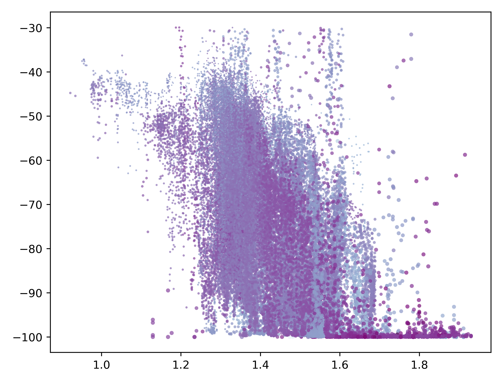

# MBIO691 Final project Yan
README 03 NOV 2024 

### Brief explanation:
The `fig_1~3.py` are scripts used for generating plots, each corresponding to a specific figure number. The figures and captions are already displayed in the `README.md` file. Please download the project's zip file, extract it, and place it in the designated path to reproduce my work. You can directly view the figures here: [Fig 1](#fig-1), [Fig 2](#fig-2), and [Fig 3](#fig-3).

### Guide to the contents
- The **data** folder is for storing the raw data. 
- The **output** folder is for saving the generated images. 
(fig4 is extra one which can be ignored)

---
### Fig. 1

Fig. 1. 

---
### Fig. 2

Fig. 2. 

---
### Fig .3

Fig. 3. 
