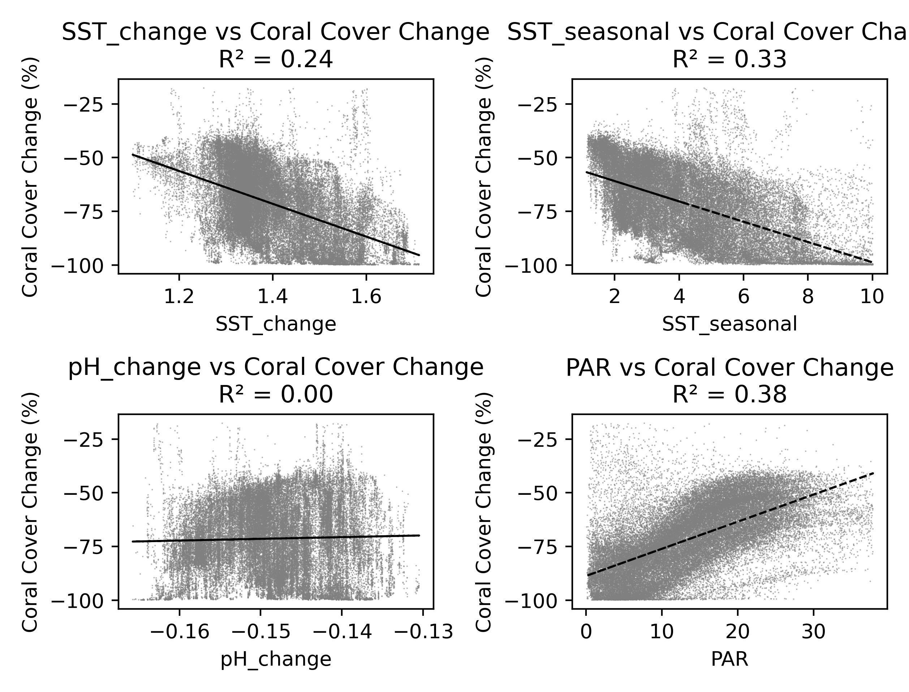

# MBIO691 Final project Yan
README 03 NOV 2024 

### Brief explanation:
The **fig_1~4.py** are scripts used for generating plots, each corresponding to a specific figure number. The images and captions are already displayed in the `README.md` file. Please download the project's zip file, extract it, and place it in the designated path to reproduce my work.

### Guide to the contents
- The **data** folder is for storing the raw data
- The **output** folder is for saving the generated images.

---

### Caption Title

---

### Caption Title

---

### Caption Title
