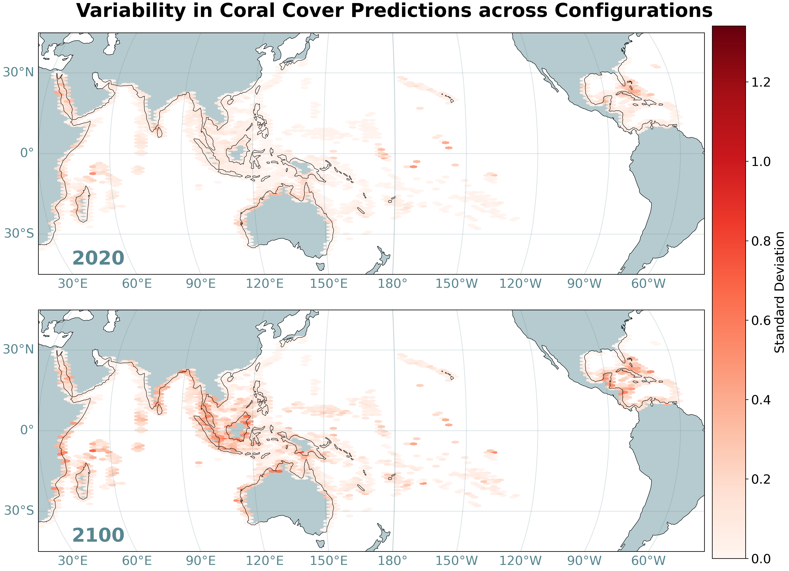

# MBIO691 Final project Yan
README 03 NOV 2024 

### Brief explanation:
The `fig_1~3.py` are scripts used for generating plots, each corresponding to a specific figure number. The figures and captions are already displayed in the `README.md` file. You can directly view the figures here: [Fig 1](#fig-1), [Fig 2](#fig-2), and [Fig 3](#fig-3). Please download the project's zip file, extract it, and place it in the designated path to reproduce my work. 

### Guide to the contents
- The **data** folder is for storing the raw data. 
- The **output** folder is for saving the generated images.

(fig_4 is an extra one which can be ignored)

---
### Fig. 1

**Fig. 1.** Geographic variability in coral cover predictions across configurations (0–11). The top and bottom panels represent predicted variability for the periods 2010–2020 and 2090–2100, respectively. Variability is represented by the standard deviation across configurations, with redder colors indicating higher standard deviation. Each hexagonal grid represents the average standard deviation of all data points within its area.

---
### Fig. 2

**Fig. 2.** Scatter plot of model variables and predicted coral cover change rate, where coral cover change represents the average percentage change across all model projections from 2010–2020 to 2090–2100. Outliers have been removed using the Interquartile Range (IQR) method, with a total sample size of N=48,643. SST_change and pH_change represent changes in sea surface temperature and pH, respectively, over the 21st century. SST_seasonal denotes the difference between winter and summer mean temperatures, and PAR refers to Benthic Photosynthetically Available Radiation. The black dashed line indicates a linear regression fit, with R² representing the correlation.

---
### Fig .3

**Fig. 3.**  
